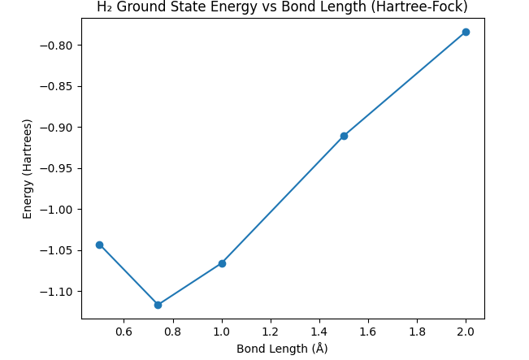

# Quantum Chemistry: H₂ Ground State Energy Visualization

**Exploring the basics of quantum chemistry simulations using OpenFermion and PySCF.** This project calculates and visualizes the ground state energy of the H₂ molecule as a function of bond length using the Hartree-Fock method.

## Project Overview

This repository contains a Python script and Jupyter notebook that calculate the ground state energy of the hydrogen molecule (H₂) at various bond lengths using the Hartree-Fock method, powered by OpenFermion and PySCF. Results are visualized as a plot of bond length vs. energy.

## How to Run
1. Clone the repository.
2. Install the required Python libraries:
   ```bash
   pip install -r requirements.txt
3. Open the Jupyter Notebook: jupyter notebook hartree_fock_h2.ipynb


